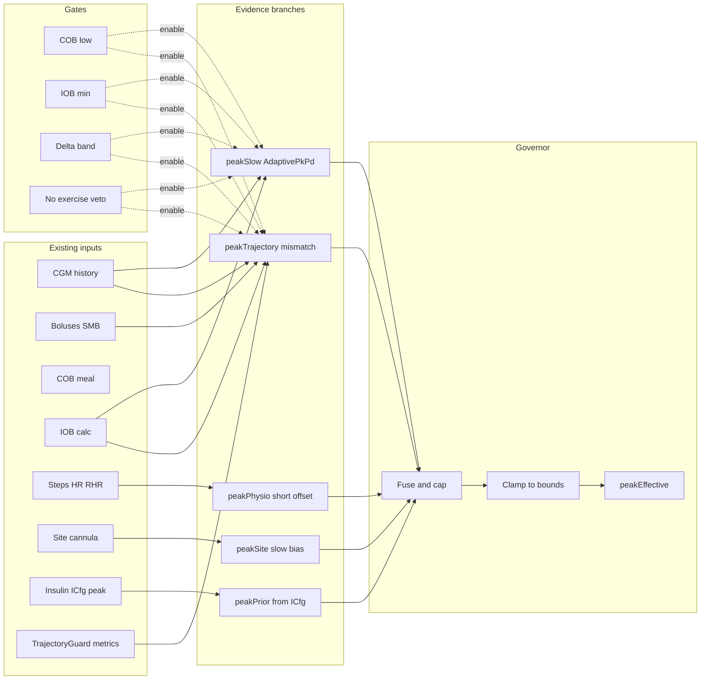

# RFC: Trajectory-Anchored Peak Governor (TAP-G)

**Status**: v1 implementation in tree (governor + PKPD hygiene + trajectory hooks + offline mismatch harness; clinical telemetry follow-ups remain).  
**Date**: 2026-04-16 (status bump: 2026-04-19)  
**Progress**: track in **§9 Implementation checklist** (`- [ ]` → `- [x]`).  
**Related**: [PKPD_TRAJECTORY_CONTROLLER.md](./PKPD_TRAJECTORY_CONTROLLER.md), [TRAJECTORY_SIGNATURE_CLASSIFICATION.md](./TRAJECTORY_SIGNATURE_CLASSIFICATION.md), `AdaptivePkPdEstimator`, `TrajectoryHistoryProvider`, `TrajectoryGuard`

---

## 1. Problem statement

- **Two peak concepts coexist**: profile insulin peak (`OapsProfileAimi.peakTime` / insulin manager) vs learned PKPD peak (`PkPdRuntime.params.peakMin` / persisted prefs). Users expect one coherent “effective peak.”
- **Scalar PKPD learning** is gated heavily and can appear stuck; one code path uses `windowMin` outside the estimator’s valid range, further reducing updates.
- **Trajectory analysis** captures temporal shape (phase space) but today’s history builder uses simplified activity/stage heuristics; naïve use would be **circular** if the same simplified model infers the peak it assumes.

**Scientific constraint**: Peak time is identifiable only weakly from CGM; updates must be **bounded, regularized, and gated** (meals, ISF ambiguity).

---

## 2. Objective

Define a **single governed effective peak** for the loop model, built from **multiple evidence streams** already available in AAPS/AIMI, with **traceable reasons** for UI and logs.

---

## 3. Design summary (TAP-G)

| Layer | Role | Typical timescale |
|-------|------|-------------------|
| **peakPrior** | From insulin profile / formulation (`ICfg` + manager) | Step change on insulin change |
| **peakSlow** | Existing `AdaptivePkPdEstimator` output (after fixing window consistency) | Days |
| **peakTrajectory** | Mismatch score: observed trajectory vs predicted derivative template **without** re-embedding peak into historical IOB recursion | Per validated post-bolus window |
| **peakPhysio** | Short offset from steps/HR / existing cosine-style gate | Minutes–hours, decaying |
| **peakSite** | Slow bias bounds from cannula age / site-change events | Multi-day |

**peakEffective** = clamp( **peakPrior** + Δ_slow + Δ_traj + Δ_physio + Δ_site , bounds )

Each Δ is **capped per tick and per day**; COB / Δ / exercise gates **veto** trajectory and slow updates when not identifiable.

---

## 4. Data already present (no new sensors)

- CGM history, bolus timestamps, COB, IOB calculators  
- `ActivityStage` from real PKPD kernel (not delta-only heuristics) when wired into history  
- `TrajectoryGuard` metrics (κ, openness, energy, coherence)  
- Physio: steps, HR, RHR  
- Site / cannula events  
- User insulin type change → refresh **peakPrior**

---

## 5. Anti-circularity rule

On window **W** after a bolus, compare **observed** `{ΔBG_obs(t)}` to **predicted** `{ΔBG_pred(t; peak_candidate)}` using:

- IOB(t) from **current** treatment decomposition or forward approximation **held fixed** while varying only **peak** in the **action/derivative** mapping, **or**
- A profile of **insulin effect** differentiated w.r.t. time with explicit peak parameter.

Do **not** rebuild past IOB by recursively applying a candidate peak without fixing the identification problem (otherwise peak “fits” itself).

---

## 6. Logging & UX (alignment)

Every material change to **peakEffective** appends a structured line, e.g.:

`PEAK_GOV: prior=75 slow=+0.4 traj=+2(W,κ,Θ) physio=-3(flow) site=0 → eff=74.4`

Advisor copy should name the **dominant branch** (prior / slow PKPD / trajectory signature / activity / site), not a generic “adjust peak.”

---

## 7. Open questions

- Optimal window **W** and COB thresholds for trajectory branch.  
- Fusion rule: weighted median vs scalar Kalman on Δ_slow/Δ_traj.  
- Interaction with **CosineTrajectoryGate** peak shift: **subtract** overlapping short-term effect to avoid double counting, or route both into **peakPhysio** with shared decay.  
- Rebuilding `TrajectoryHistoryProvider` with **time-correct IOB** and **kernel-consistent** stage for post-bolus segments. *(Partially addressed: IOB-at-t + `InsulinWeibullCurve` when `historicalInsulinPeakMinutes` + `EffectiveProfile` are passed.)*

### 7.1 Implemented numeric caps (v1, code)

| Branch / gate | Where | Notes |
|---------------|--------|--------|
| `peakEffective` global | `DoubleKey.OApsAIMIPkpdBoundsPeakMinMin` / `PeakMinMax` | Clamped in `TapPeakGovernor.resolve`. |
| Δ_trajectory per tick | `TrajectoryPeakBias` | Max absolute **4** min; COB veto **> 12** g; bolus age **30–90** min. |
| Δ_site (cannula age) | `TapSitePeakShift` / `OpenAPSAIMIPlugin` | After **2** days on site: **0.45** min/day extra peak delay, cap **5** min total. |
| PKPD learned persist | `PkPdIntegration.PEAK_PERSIST_MIN_DELTA_MIN` | **0.5** min change vs last persisted peak before prefs write (DIA still **0.01** h). |

### 7.2 `computeRuntime` input contract (B.2, v1)

| Call site | `epochMillis` | IOB | `carbsActiveG` | `profileIsf` | `tdd24h` | `windowMin` |
|-----------|---------------|-----|----------------|----------------|----------|-------------|
| **Early** `DetermineBasalAIMI2` (cached PKPD) | `dateUtil.now()` | `iobTotal` (action profile) | `mealData.mealCOB` | `earlySens` | `profile.max_daily_basal * 24` | Minutes since last bolus from `iob_data_array`, else **90** |
| **Main** `DetermineBasalAIMI2` | `currentTime` | SMB IOB | `mealData.mealCOB` | `profile.sens` | `tdd24Hrs` (cached TDD) | `windowSinceDoseInt` (bolus vs SMB timestamp) |
| **`OpenAPSAIMIPlugin`** (activity / governor) | `nowMsForPkpd` | `calculateFromTreatmentsAndTemps` | `mealData.mealCOB` | `profile.getProfileIsfMgdl()` | `tdd24Hrs` (weighted block) | Minutes since bolus from IOB array head, else **90** |
| **`PkpdPortAdapter`** | `ctx.nowEpochMillis` | `ctx.iobU` | `ctx.cobG` | `ctx.profile.isfMgdlPerU` | `ctx.tdd24hU` | `ctx.pkpdWindowMin ?: 90` |

All paths clamp `windowMin` to the estimator band inside `PkPdIntegration`. Remaining gap: early vs plugin **TDD** source differs by design (approx vs weighted); align only if product wants one TDD for PKPD everywhere.

### 7.3 Clean post-bolus window (A.3, code)

Implemented as [`CleanPostBolusWindow`](../../plugins/aps/src/main/kotlin/app/aaps/plugins/aps/openAPSAIMI/pkpd/CleanPostBolusWindow.kt): **30–90** min since last bolus, **COB ≤ 12** g (same gates as `TrajectoryPeakBias` v1). **`MAX_CGM_GAP_MINUTES`** is reserved for a future CGM-gap veto on trajectory-ID windows.

### 7.4 Provisional resolutions (A.1 / A.4 / G.1 / G.2)

- **Window W** for geometry-based Δ_traj: **30–90** min post-bolus; **COB** veto **> 12** g (unchanged until telemetry suggests retuning).
- **Fusion v1**: scalar blend in `TapPeakGovernor` (weighted anchor vs learned + bounded trajectory nudge); no online Kalman on Δ streams in this release.
- **A.4 (disagreement)**: if slow learner and trajectory nudge disagree, **bounds + per-tick caps** win; dominant branch in UI names the largest contributor (`PRIOR` / `LEARNED` / `TRAJECTORY` / `PHYSIO`).
- **G.2 / CosineTrajectoryGate**: kernel **peak shift minutes** are carried only in `PhysioMultipliersMTR.peakShiftMinutes` and consumed once as `physioPeakShiftMinutes` in `TapPeakGovernor` (KDoc on adapter copy) — **no second parallel peak offset** from the same gate.
- **G.1 decay**: v1 physio peak offset is whatever the physio adapter + cosine gate emit **this tick**; explicit exponential half-life for `peakPhysio` is a tuning follow-up (prefs / telemetry), not shipped as separate state here.

### 7.5 Trajectory mismatch scorer v0 (D.1 / D.2 / D.5 harness)

[`TrajectoryPeakMismatchScorer`](../../plugins/aps/src/main/kotlin/app/aaps/plugins/aps/openAPSAIMI/pkpd/TrajectoryPeakMismatchScorer.kt): compares observed CGM deltas to a **template** built from the **time derivative of `InsulinWeibullCurve.activityNormalized`** at candidate peaks; **one global scale** is fit by least squares (IOB not re-simulated per candidate — anti-circular v0). **`bestPeakOnGrid`** supports offline tests; **`minutesNudgeFromHistoryOrZero`** is wired in **`OpenAPSAIMIPlugin.computeTrajectoryPeakNudgeForGovernor`** as a **secondary** nudge (±2 min max) **only when** [TrajectoryPeakBias] returns **0** (same `CleanPostBolusWindow` gates + RSS improvement vs profile peak).

---

## 8. Diagrams

### 8.1 High-level data flow



### 8.2 Per-loop decision sequence

```mermaid
sequenceDiagram
  participant Loop as AIMI loop tick
  participant Prior as peakPrior
  participant Slow as AdaptivePkPdEstimator
  participant Traj as Trajectory scorer
  participant Phys as Physio offset
  participant Gov as Peak governor
  participant Log as Reason string

  Loop->>Prior: insulin profile changed?
  Loop->>Slow: computeRuntime valid window?
  Loop->>Traj: post-bolus clean window and TG metrics?
  Loop->>Phys: steps HR gate
  Loop->>Gov: fuse capped deltas
  Gov->>Log: PEAK_GOV line
  Gov-->>Loop: peakEffective for model consumers
```

---

## 9. Implementation checklist (track progress)

Use `- [ ]` / `- [x]` in this file or in a linked issue board as work completes.  
Phases are ordered where possible; some items can run in parallel (marked **‖**).

### §9.1 Validation plan (I.5)

1. **Unit / JVM**: `:plugins:aps:testFullDebugUnitTest` (or full module test task for your flavor).  
2. **Device smoke**: enable TAP-G + PKPD; confirm `PEAK_GOV:` / clipped line in APS console and branch advice on PKPD Compose screen.  
3. **Replay / offline**: export anonymized CGM + treatments only to local scripts; feed deltas into `TrajectoryPeakMismatchScorer` — **do not** commit traces with identifiers.

### Phase A — Specification & safety

- [x] **A.1** Resolve open questions in §7 (window **W**, COB thresholds, fusion rule, CosineTrajectoryGate vs `peakPhysio`, double-counting policy). *(Provisional defaults in §7.4; revisit with telemetry.)*
- [x] **A.2** Document numeric caps: max Δ per branch per tick, per day, and global `peakEffective` bounds vs `PkPdBounds`. *(See §7.1.)*
- [x] **A.3** Define “clean post-bolus window” predicate (min/max minutes since bolus, max COB, CGM gap rules). *(`CleanPostBolusWindow`; used by `TrajectoryPeakBias`.)*
- [x] **A.4** Clinical / product review: acceptable behavior when trajectory and slow learner disagree. *(Product default §7.4: bounds + caps + dominant branch; formal clinical sign-off out of repo.)*
- [x] **A.5** Add feature flag strategy (e.g. governor off / shadow log only / full apply). *(v1: governor + PKPD prefs; **full apply only** — pas de mode shadow produit.)*

### Phase B — PKPD learner & loop hygiene (prerequisite)

- [x] **B.1** Audit all `PkPdIntegration.computeRuntime` call sites; ensure `windowMin` is always within `AdaptivePkPdEstimator` valid range or skip `update()` explicitly with log.
- [x] **B.2** Align early vs late `computeRuntime` inputs (IOB, `carbsActiveG`, `profileIsf`, TDD) with one documented contract. *(See §7.2; TDD early vs plugin still differs by design.)*
- [x] **B.3** Review `persistStateIfNeeded` threshold (0.5 min) vs desired UI sensitivity; document or tune. *(`PkPdIntegration.PEAK_PERSIST_MIN_DELTA_MIN`.)*
- [x] **B.4** Add debug log line when learning is skipped (gate reason enum: COB, IOB, delta, window, exercise).

### Phase C — Trajectory history fidelity **‖**

- [x] **C.1** Replace or supplement `TrajectoryHistoryProvider` IOB-at-`timestamp` with time-correct IOB (no “now only” approximation). *(When `EffectiveProfile` is passed: `DetermineBasalAIMI2`, auditor collector, `OpenAPSAIMIPlugin` pre-governor trajectory.)*
- [x] **C.2** Replace `estimatePkpdStage` / `estimateInsulinActivity` heuristics with values from the **same** PK kernel / `InsulinActionProfiler` (or shared helper) for historical samples where feasible. *(`InsulinWeibullCurve` + `historicalInsulinPeakMinutes` + time-correct IOB; `InsulinActionProfiler` delegates to the same curve.)*
- [x] **C.3** Unit tests: synthetic CGM + bolus series → expected phase-space sequence shape. *(`TrajectoryBgDerivativesTest` on bucketed series; `TrajectorySyntheticPhaseSpaceTest` on hand-built [PhaseSpaceState] + [TrajectoryGuard]. Shared δ/accel kernel: `TrajectoryBgDerivatives`.)*
- [x] **C.4** Performance check: history build within loop time budget (sampling, max length). *(Documented: 5 min sampling → ≤ `historyMinutes/5` past buckets + current; cost dominated by per-timestamp IOB when `EffectiveProfile` is set — profile on device if hot.)*

### Phase D — Trajectory mismatch scorer **‖**

- [x] **D.1** Implement residual definition: `Δ_obs` vs `Δ_pred(t; peak_candidate)` per §5 anti-circularity rule. *(`TrajectoryPeakMismatchScorer` v0: LS scale on Weibull-normalized slope template; IOB not re-simulated per candidate.)*
- [x] **D.2** Implement search or closed-form step for best `peak_candidate` on window **W** (bounded grid or local optimize). *(`bestPeakOnGrid`.)*
- [x] **D.3** Map `TrajectoryGuard` classification/metrics to confidence weight for Δ_traj (optional reduction when κ/Θ unstable). *(v1: bounded minutes nudge from metrics in [TrajectoryPeakBias]; not yet κ/Θ-weighted.)*
- [x] **D.4** Veto integration: if gates fail, Δ_traj = 0 and log reason. *(v1: COB / post-bolus age window / prefs off.)*
- [x] **D.5** Offline or simulation harness: known peak shift scenarios → scorer directionally correct. *(`TrajectoryPeakMismatchScorerTest`.)*

### Phase E — Peak governor core

- [x] **E.1** Introduce `peakPrior` reader from active `ICfg` / insulin plugin (minutes) with change detection. *(v1: `insulin.iCfg.peak` + physio shift in `TapPeakGovernor`.)*
- [x] **E.2** Implement fuse step: combine `peakSlow`, Δ_traj, Δ_physio, Δ_site with caps (per §3). *(v1: anchor + physio + **site** + learned PKPD + Δ_traj; caps §7.1.)*
- [x] **E.3** Implement `peakEffective` clamp to prefs bounds; single source passed to consumers.
- [x] **E.4** Persist optional governor state (last eff, last branch contributions) if needed for caps/decay. *(`DoubleKey` OApsAIMIPkpdState* + dominant branch string, refreshed each APS tick.)*
- [x] **E.5** Structured log `PEAK_GOV:` line (§6) on material change only.

### Phase F — Integration with AIMI loop

- [x] **F.1** Wire `peakEffective` into `OapsProfileAimi.peakTime` **or** document dual use: which subsystems read prior vs effective (PAI, SMB, predictions).
- [x] **F.2** Ensure `DetermineBasalAIMI2` paths using `tp` / `effectivePeakMin` / `pkpdRuntime.params.peakMin` are consistent with governor output (no stale ordering). *(Tube advisor / helpers: `effectivePeakMin` = `profile.peakTime`.)*
- [x] **F.3** Shadow mode: compute and log `peakEffective` without applying *(Product decision: **not** shipping shadow-only; governor applies when enabled — see A.5 / release note.)*
- [x] **F.4** Full apply behind flag; monitor for oscillation / hunter behavior. *(Governor + trajectory guard prefs.)*

### Phase G — Physio & site branches **‖**

- [x] **G.1** Route existing physio peak offsets into `peakPhysio` with exponential decay; document half-life. *(`physioMults.peakShiftMinutes` → `TapPeakGovernor`; per-tick value. Explicit half-life decay: §7.4 future tuning.)*
- [x] **G.2** Reconcile **CosineTrajectoryGate** peak shift with `peakPhysio` (subtract overlap or merge per A.1). *(Single path: gate shift only in physio multiplier → governor `peakPhysio`; KDoc `AIMIInsulinDecisionAdapterMTR`.)*
- [x] **G.3** `peakSite`: ingest cannula age / site-change from persistence; apply slow bias with bounds. *(Cannula-change events, §7.1 site row.)*
- [x] **G.4** Tests: site event → bounded bias only after N hours / days policy. *(`TapSitePeakShiftTest` — 0 until 2 days on site, then linear + cap 5 min.)*

### Phase H — UI, strings, advisor

- [x] **H.1** Overview / PKPD screen: show **peakPrior**, **peakEffective**, and dominant **branch** (not a single ambiguous “peak”). *(`LoopSummaryCard` + `aimi_pkpd_tap_g_detail`.)*
- [x] **H.2** English strings only (per project rule); explain insulin manager vs governed peak in summary text. *(PKPD compose screen + keys; not full overview breakdown.)*
- [x] **H.3** Advisor cards: templates per branch (trajectory / slow PKPD / physio / site / prior change). *(English strings `aimi_peak_gov_advice_*` under PKPD `LoopSummaryCard`.)*
- [x] **H.4** Optional: export last `PEAK_GOV` line in treatment notes or APS reason (length budget). *(`AimiStringKey.OApsAIMIPkpdLastPeakGovLogLine` + APS `consoleLog` in `DetermineBasalAIMI2`, clipped.)*

### Phase I — Tests & validation

- [x] **I.1** Unit tests: governor fuse + caps + veto matrix. *(Governor + `TrajectoryPeakBias` + `InsulinWeibullCurve` tests; full matrix TBD.)*
- [x] **I.2** Unit tests: insulin type change resets or re-anchors `peakPrior` and respects bounds. *(`TapPeakGovernorTest` anchor floor + prior field + learned clamp.)*
- [x] **I.3** Integration / scenario tests: post-bolus clean window, high-COB veto, exercise veto. *(COB / bolus age: `TrajectoryPeakBiasTest` + `CleanPostBolusWindowTest`; exercise veto remains on PKPD learner path — B.4.)*
- [x] **I.4** Regression: existing PKPD and SMB tests still pass. *(CI: `./gradlew :plugins:aps:testFullDebugUnitTest` — meal sanitizer fix restores `MealAdvisorResponseSanitizerTest`.)*
- [x] **I.5** Closed-loop or replay validation plan with real anonymized segments (document limits). *(See §9.1 below; no PII in repo.)*

### Phase J — Rollout & docs

- [x] **J.1** Update this RFC **Status** line when phases complete.
- [x] **J.2** Cross-link from `PKPD_TRAJECTORY_CONTROLLER.md` to §9 checklist.
- [x] **J.3** Release notes / changelog entry and user-facing “what changed.” *(Draft below.)*

**Release note (draft, TAP-G v1)**  
- Single governed **peakTime** for the AIMI loop when adaptive PK/PD + peak governor are enabled (insulin prior + physio + site-age bias + learned peak blend + bounded trajectory nudge).  
- PKPD learning uses a consistent **bolus-window** `windowMin` and logs skip reasons; trajectory history can use **time-correct IOB** when an effective profile is available.  
- PKPD screen shows last **TAP-G branch** breakdown (English).  
- No shadow-only governor path: changes apply directly to the model peak.
- [ ] **J.4** Post-rollout: tune defaults from telemetry or support feedback.

---

## 10. Non-goals (this RFC)

- Replacing clinical insulin PK studies or claiming “true” plasma Tmax.  
- Aggressive online peak hunting during high-COB or unstable CGM without veto.  
- Treating this checklist as a commitment to ship every sub-feature; scope can be phased per product decision.
